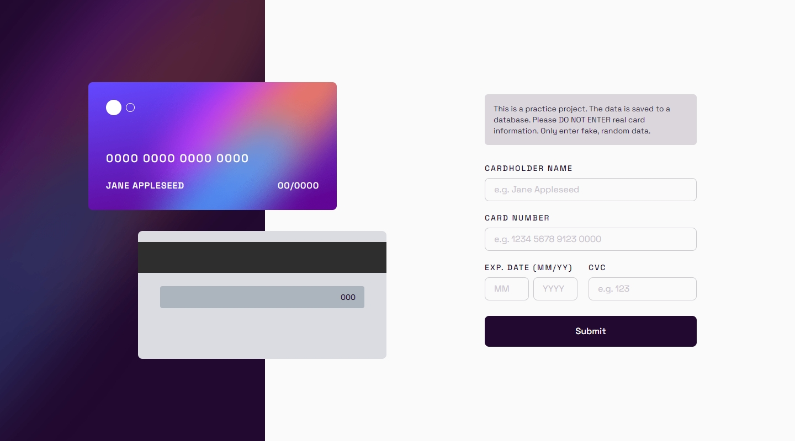
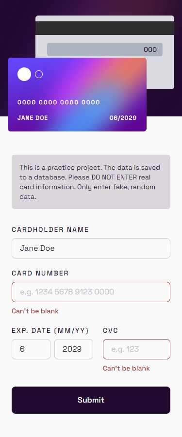

## Frontend Mentor Challenge 30 - Interactive Card Details Form

This is my solution to the [Interactive Card Details Form](https://www.frontendmentor.io/challenges/interactive-card-details-form-XpS8cKZDWw) challenge on [Frontend Mentor](https://www.frontendmentor.io/).

#

### Links 🔗

- Live Site URL: https://interactive-card-details-form-darkstarxdd.vercel.app/

#

### Built with 🔨

- Next.js
- TypeScript
- Tailwind
- React Hook Form
- Zod - Client side and server side validation
- React Aria - [DateField component](https://react-spectrum.adobe.com/react-aria/DateField.html) for the Exp. Date
- Prisma ORM
- Supabase (Postgres database)
- Motion (Small animation for the submission confirmation checkmark)

#

### Features ✨

- User can save card details to a database.
- Card details are updated in the UI as the user types.
- An Error message is shown if the card number already exists in the database.
- Success view on succesful card entry.
- Client side validation errors are shown for empty inputs or if the data is in the wrong format.

#

### Technical Details 🔧

- The form state is managed by React Hook Form. So inputs are uncontrolled. `useWatch()` hook from RHF gives the most recent values in the form inputs, so I used it to update the card UI as the user types.
- While RHF allows us to use the native browser validation, I used Zod to do the validation since it gives a lot of control over the things we can validate over. Plus the same schema can be used for the server side validation as well.
- Integrated Zod with RHF using `zodResolver` from `@hookform/resolvers/zod`.
- On submit, client side validation runs first. If valid, data is sent to the backend using a server action.
- The same Zod schema validates the data again inside the server action.
- If validation passes, a Prisma query is called inside the server action and the data is submitted to the database.
- If something goes wrong inside the server action (validation fails, prisma throws an error etc.) formatted error messages are returned to the frontend and displayed to the user. If successful no data is returned.

#

### Screenshots of the Solution (Desktop & Mobile) 🔍

#

- Some tools i use - [DarkstarXDD/tools](https://gist.github.com/DarkstarXDD/4b1844eda12f34b667a0c36e05fcbdf9)
- My Frontend Mentor profile - [@DarkstarXDD](https://www.frontendmentor.io/profile/DarkstarXDD)
